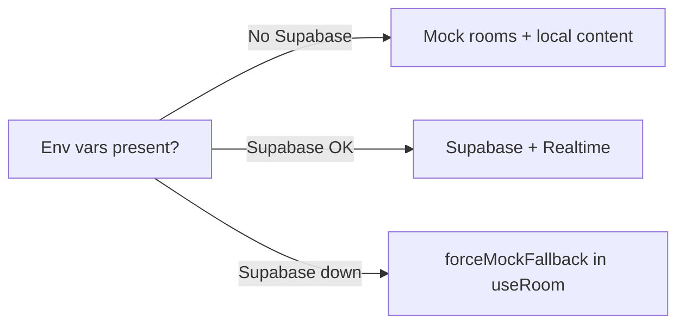

# CineSwipe

Swipe movies and web series solo or in real-time multiplayer rooms. Built with Next.js 16 App Router, React 19, Tailwind v4, Supabase, and Razorpay.

**Last verified:** 2026-05-23

## Quick start

```bash
npm install
npm run dev          # http://localhost:3000
npm run lint         # 0 errors (warnings only)
npm run build
npx playwright install chromium   # first-time E2E
npm test             # requires dev server running
```

## Environment variables

| Variable | Required | Purpose |
| --- | --- | --- |
| `NEXT_PUBLIC_SUPABASE_URL` | Optional | Enables Supabase + Realtime mode |
| `NEXT_PUBLIC_SUPABASE_ANON_KEY` | Optional | Supabase client credentials |
| `NEXT_PUBLIC_TMDB_API_KEY` | Optional | TMDB API fallback key |
| `NEXT_PUBLIC_RAZORPAY_KEY_ID` | Optional | Razorpay key for checkout UI |
| `RAZORPAY_KEY_SECRET` | Optional | Razorpay key secret for payment verification |

Without Supabase environment variables, multiplayer rooms automatically use in-memory mock APIs under `/api/rooms/*`.

## Repository map

| Folder | README | Responsibility |
| --- | --- | --- |
| [`app/`](app/README.md) | Yes | Routes, layouts, and API handlers |
| [`components/`](components/README.md) | Yes | Reusable UI components (swipe deck, lobby, paywalls) |
| [`hooks/`](hooks/README.md) | Yes | Client state and custom side-effect hooks |
| [`lib/`](lib/README.md) | Yes | Shared business logic, database connectors, and validation |
| [`public/`](public/README.md) | Yes | Static assets and webapp manifests |
| [`tests/`](tests/README.md) | Yes | Automated Playwright and recommendation test suites |
| [`Architecture.md`](Architecture.md) | — | Production system-wide architecture |

## Runtime modes



Content precedence in `useMovies`: Supabase `movies_catalog` → TVMaze filling stream.
