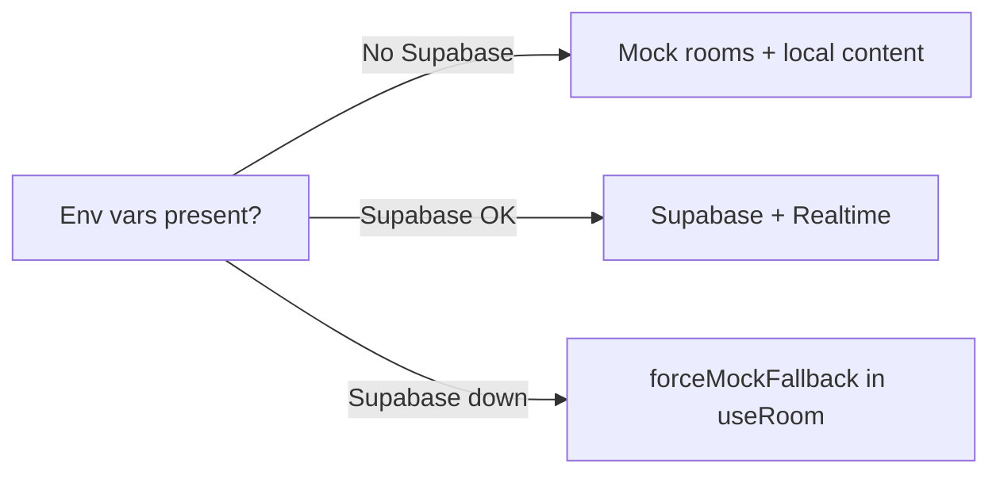

# CineSwipe

Swipe movies and web series solo or in real-time multiplayer rooms. Built with Next.js 16 App Router, React 19, Tailwind v4, Supabase, TMDB, and Razorpay.

**Last verified:** 2026-05-21

## Quick start

```bash
npm install
npm run dev          # http://localhost:3000
npm run lint         # 0 errors (warnings only)
npm run build
npx playwright install chromium   # first-time E2E
npm test             # requires dev server running
```

## Environment variables

| Variable | Required | Purpose |
| --- | --- | --- |
| `NEXT_PUBLIC_SUPABASE_URL` | Optional | Enables Supabase + Realtime mode |
| `NEXT_PUBLIC_SUPABASE_ANON_KEY` | Optional | Supabase client |
| `NEXT_PUBLIC_TMDB_API_KEY` | Optional | Live catalog from TMDB |
| `NEXT_PUBLIC_RAZORPAY_KEY_ID` | Optional | Checkout UI |
| `RAZORPAY_KEY_SECRET` | Optional | Server payment verify |

Without Supabase env vars, multiplayer uses in-memory mock APIs under `/api/rooms/*`.

## Repository map

| Folder | README | Responsibility |
| --- | --- | --- |
| [`app/`](app/README.md) | Yes | Routes, layouts, API handlers |
| [`components/`](components/README.md) | Yes | UI (swipe deck, lobby, modals) |
| [`hooks/`](hooks/README.md) | Yes | Client state and side effects |
| [`lib/`](lib/README.md) | Yes | Shared logic, TMDB, Supabase, validation |
| [`public/`](public/README.md) | Yes | Static assets, PWA manifest |
| [`tests/`](tests/README.md) | Yes | Playwright QA scripts |
| [`Architecture.md`](Architecture.md) | — | System-wide architecture and QA plan |

## Runtime modes



Content precedence in `useMovies`: Supabase `movies_catalog` → TMDB → `lib/tmdb/mock-data`.

## Verified QA (2026-05-21)

| Check | Result |
| --- | --- |
| `npm run build` | Pass |
| `npm run lint` | Pass (0 errors, warnings only) |
| `npm run dev` | Pass at localhost:3000 |
| Room API validation | `^[A-Z0-9]{6}$`, 409 on duplicate |
| Payment verify | Requires fields; dev mock needs sandbox shape |

## Known global issues

1. **Lint warnings** — unused imports resolved in pages; `useRoom` hook dependency warnings may remain.
2. **Supabase catalog** — `movies_catalog` added to [`lib/supabase/schema.sql`](lib/supabase/schema.sql); must be applied in Supabase SQL editor.
3. **E2E tests** — require `npm run dev` + `npx playwright install chromium`.
4. **Mock rooms** — lost on server restart (`lib/mock-store.ts`).

## Agent workflow

1. Read the README in the folder you are changing.
2. Implement fixes; run folder verification checklist.
3. Re-run `npm run lint`, `npm run build`, and relevant tests.
4. Update [`Architecture.md`](Architecture.md) and bump **Last verified** when all gates pass.

## After successful execution

Update `Architecture.md` sections 1–3 and QA tables. Set `Last verified: YYYY-MM-DD` at the top of that file.
